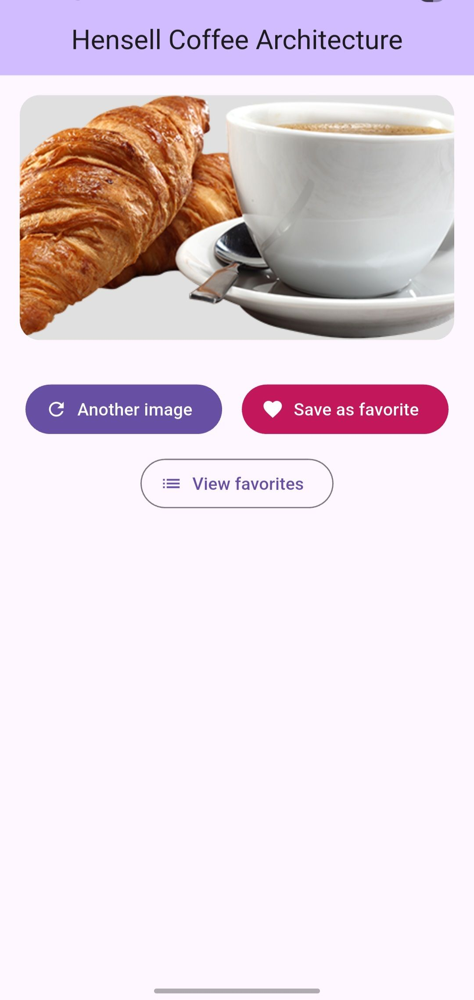
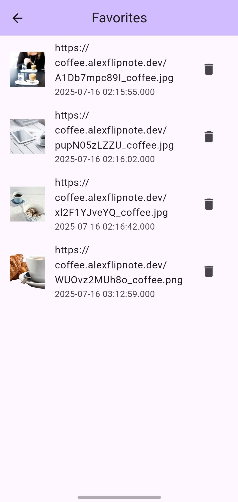

# Hensell Coffee Architecture

[![style: very good analysis][very_good_analysis_badge]][very_good_analysis_link]
[![License: MIT][license_badge]][license_link]
[](https://opensource.org/licenses/MIT)
[](https://flutter.dev)
## 🚀 Overview

**Hensell Coffee Architecture** is a Flutter app demonstrating an advanced architecture approach using:

- **Very Good CLI Architecture (VGV style)**
- **Cubit (flutter_bloc) for state management**
- **GoRouter for navigation**
- **Drift for local persistence**
- **CachedNetworkImage for image loading**
- **Integration & Unit tests with mocktail & mocktail_image_network**

---

### Preview

<p align="center">
  
  
  
</p>


---
## 🏛️ Architecture

- **Domain Layer:** Pure Dart entities, usecases, repositories (abstraction)
- **Data Layer:** Implementation of repositories, local + remote data sources
- **Presentation Layer:** Widgets, Cubits, Views, Navigation

Example Flow:

```
CoffeeView → CoffeeCubit → FetchRandomCoffeeImageUrl UseCase → Repository → RemoteDataSource
```

---

## 🧪 Testing

✅ Unit tests  
✅ Widget tests  
✅ Integration tests (via integration_test)

Run tests locally:

```
very_good test --coverage --test-randomize-ordering-seed random
```

ℹ **Note:** On CI or local, you need a `key.properties` (see below).

---

## 🔧 How to Run

1️⃣ Clone the repo:

```
git clone https://github.com/Hensell/hensell_coffee_architecture.git
cd hensell_coffee_architecture
```

2️⃣ Setup Android:

- Create `android/key.properties` with:

```
storePassword=your_store_password
keyPassword=your_key_password
keyAlias=your_key_alias
storeFile=your_keystore_file_path
```

Without this, the Android build will fail.

3️⃣ Get packages:

```
flutter pub get
```

4️⃣ Run:

```
flutter run --flavor development -t lib/main_development.dart
```

---

## 📲 Download APK

Get the latest APK here:

👉 [Download APK (V1.0.0)](https://github.com/Hensell/hensell_coffee_architecture/releases/tag/main)

---

## ⚙️ Features

✅ Random coffee image fetch  
✅ Save as favorite (local or URL, depending on platform)  
✅ Favorites list with local storage (Drift)  
✅ Offline mode fallback  
✅ Localization (EN, ES)  
✅ Integration & unit tests  
✅ Clean architecture separation

---

## 💡 Notes

- Web: only URL saving (no local image save)  
- Android/iOS: local file saving enabled  
- Offline? Favorites still accessible.

---

## 👤 Author

Developed with 💙 by **Hensell**

[GitHub](https://github.com/Hensell)

---

## 📄 License

MIT License

[coverage_badge]: coverage_badge.svg
[flutter_localizations_link]: https://api.flutter.dev/flutter/flutter_localizations/flutter_localizations-library.html
[internationalization_link]: https://flutter.dev/docs/development/accessibility-and-localization/internationalization
[license_badge]: https://img.shields.io/badge/license-MIT-blue.svg
[license_link]: https://opensource.org/licenses/MIT
[very_good_analysis_badge]: https://img.shields.io/badge/style-very_good_analysis-B22C89.svg
[very_good_analysis_link]: https://pub.dev/packages/very_good_analysis
[very_good_cli_link]: https://github.com/VeryGoodOpenSource/very_good_cli
